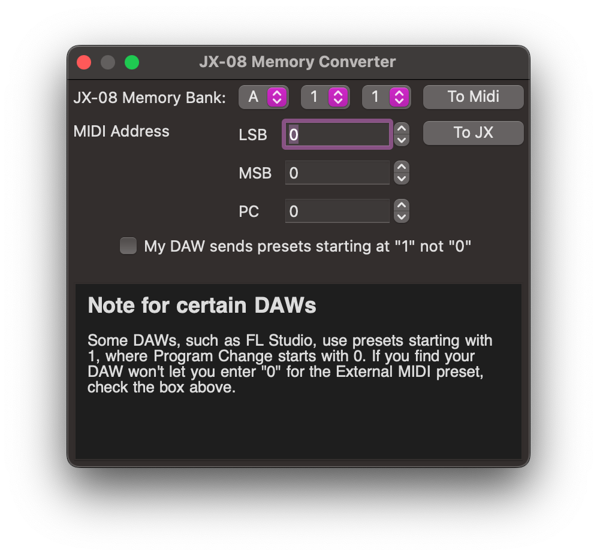
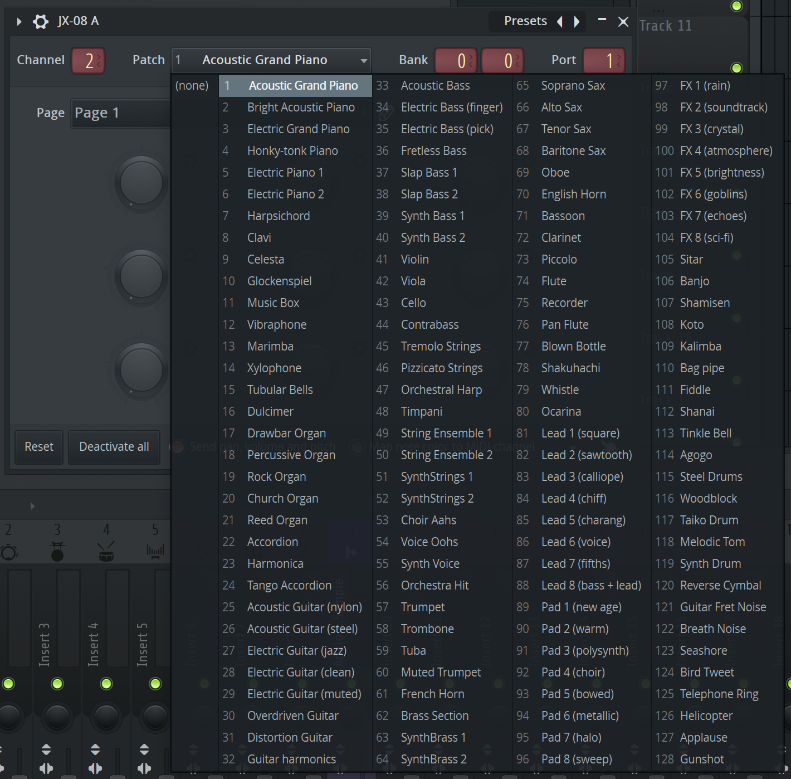
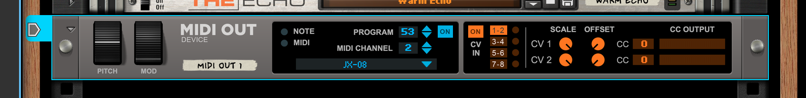

# JX-08 Preset Conversion Tool
Have you played around with your JX-08 and got the perfect sound for the song, but needed to change the patch while
playing the MIDI file? If working on multiple pieces through a DAW, do you wish you could store the correct preset and
send it back? The JX-08 Preset Conversion Tool helps with both of these tasks.

This tool allows you to easily convert the presets from the Roland Boutique synthesizers' preset memory nomenclature to
the program control values sent via the MIDI channels. This project was written for the Roland JX-08 sound module, and
was also tested with the Roland JD-08 sound module.

## Usage
Using this application is quite simple. Just launch the executable.

### Convert JX-08 preset to MIDI program control
In the program, select the preset you wish to use from the group, bank, and number on the sound module. This is
typically displayed on the 7-segment LED display. As you change these values, the MIDI settings will automatically
update.

### Convert from the MIDI Program Control to JX-08 Preset
To convert back from the DAW to the JX-08 preset, enter the settings under MIDI Address and the JX-08 values above will
automatically update.

## A Note on DAWs
Some DAWs, such as [FL Studio](https://www.image-line.com/fl-studio/), show the preset patch number starting with `1`
instead of `0`. If you are using one of these DAWs, ensure you check the box `My DAW shows presets starting at "1"` to
to get the appropriate mapping. See the image below.

[Reason Studio](https://www.reasonstudios.com/en/reason) does not support sending bank information from the main
interface, but they do support changing the banks via automations. See [their help file](https://docs.propellerheads.se/reason12/wwhelp/wwhimpl/common/html/wwhelp.htm#context=EngOpManProjectPro&file=ExternalMIDIInstrument.45.2.html)
for more information on this process. The `Program` number is the preset number shown in the JX-08 Conversion Tool.

## Compatible Synthesizers
The confirmed compatible Roland Boutique sound modules are:
* [JD-08](https://www.roland.com/us/products/jd-08/)
* [JX-08](https://www.roland.com/us/products/jx-08/)

This tool may work for other synthesizers that utilize the same addressing for preset patches.

## A Note on the Roland Boutique Audio Interfaces
The JD-08 and JX-08's audio interface includes 8 channels:

1. Mix Out Left
2. Mix Out Right
3. Part A Left
4. Part A Right
5. Part B Left
6. Part B Right
7. Mix In Left
8. Mix In Right

I hope this may help others who are using these wonderful synthesizers for music production.

## A Call For Help
If you see something broken, please let me know through the [issue tracker](issues)
or, if you can, make a pull request. Thank you.
